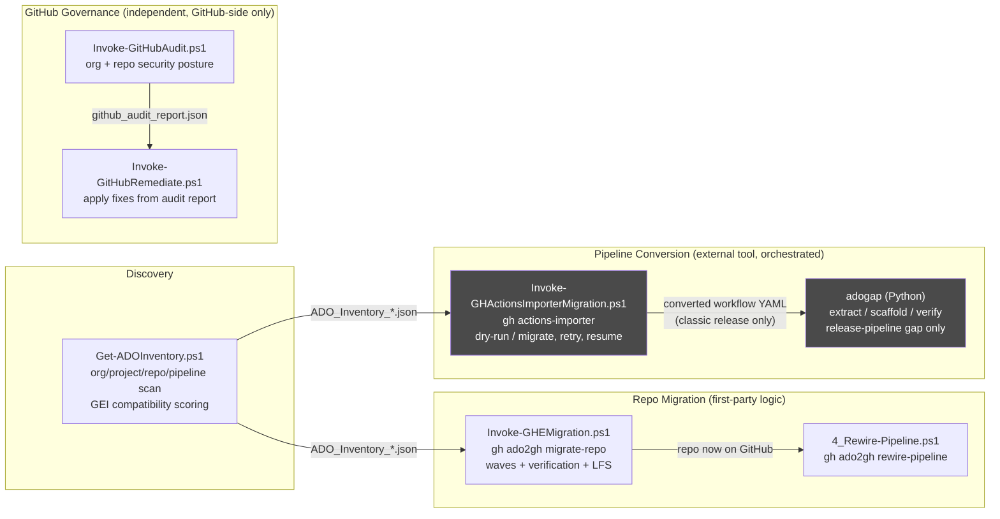
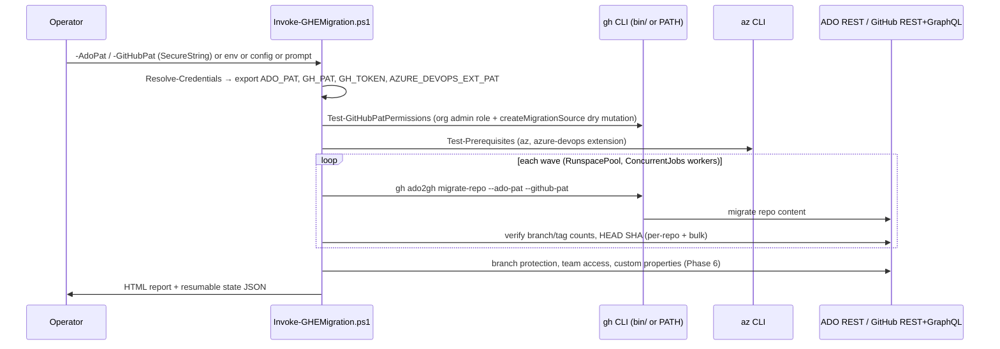

# GitHub Migration Toolkit — Azure DevOps → GitHub Enterprise

**Internal toolkit.** Classification: Internal — do not share outputs externally (see [`CLAUDE.md`](CLAUDE.md)).

An orchestration toolkit — six PowerShell 7 scripts plus one Python package —
for planning and executing an **Azure DevOps (ADO) → GitHub Enterprise Cloud
(GHEC)** migration: org-wide discovery and compatibility scoring, Git
repository history migration, pipeline reconnection, Azure Pipelines →
GitHub Actions conversion, a gap-filler for what that conversion silently
drops on classic release pipelines, and post-migration GitHub security
audit/remediation.

**What this toolkit is not**: it is not a YAML pipeline parser, converter, or
task-mapping engine. Wherever ADO pipeline *content* has to become GitHub
Actions YAML, this toolkit shells out to GitHub's own `gh ado2gh` and
`gh actions-importer` CLI extensions and orchestrates them (selection,
retries, rate-limit handling, resumability, reporting). The construct-by-
construct conversion logic inside those extensions is closed-source and not
part of this repository — this README says so explicitly everywhere it's
relevant, rather than implying broader coverage than the code has. See
[§5 ADO → GitHub Migration Support](#5-azure-devops--github-migration-support)
for the detailed, evidence-based breakdown.

---

## Table of Contents

1. [Executive Overview](#1-executive-overview)
2. [Toolkit Components](#2-toolkit-components)
3. [Feature Inventory](#3-feature-inventory)
4. [Repository Structure](#4-repository-structure)
5. [Azure DevOps → GitHub Migration Support](#5-azure-devops--github-migration-support)
6. [Migration Mapping Matrix](#6-migration-mapping-matrix)
7. [Prerequisites](#7-prerequisites)
8. [Authentication & Permissions](#8-authentication--permissions)
9. [End-to-End Usage Guide](#9-end-to-end-usage-guide)
10. [Configuration Reference](#10-configuration-reference)
11. [Architecture & Internal Design](#11-architecture--internal-design)
12. [Generated Outputs](#12-generated-outputs)
13. [Validation & Testing](#13-validation--testing)
14. [Development & Contributor Guide](#14-development--contributor-guide)
15. [Security Guide](#15-security-guide)
16. [Known Limitations & Gap Analysis](#16-known-limitations--gap-analysis)
17. [Folder Restructuring Recommendations](#17-folder-restructuring-recommendations)
18. [Roadmap Recommendations](#18-roadmap-recommendations)
19. [Troubleshooting](#19-troubleshooting)
20. [Glossary](#20-glossary)
21. [Migration Readiness Checklist](#21-migration-readiness-checklist)
22. [Post-Migration Validation Checklist](#22-post-migration-validation-checklist)
23. [Contributor Checklist](#23-contributor-checklist)
24. [Further Reading](#24-further-reading)

---

## 1. Executive Overview

**Problem solved**: migrating from Azure DevOps to GitHub Enterprise is not
one operation — it's Git history migration, pipeline conversion, security
posture setup, and a long tail of ADO constructs (approvals, gates, service
connections, variable groups) that don't have a 1:1 GitHub equivalent. Doing
this by hand, repo by repo, doesn't scale past a handful of repos and loses
auditability. This toolkit wraps the individual GitHub-provided CLI tools
(`gh ado2gh`, `gh actions-importer`) in first-party PowerShell/Python
orchestration that adds: org-wide discovery and readiness scoring before you
start, wave-based parallel execution with resumable state, pre- and
post-migration verification (branch/tag/HEAD-SHA counts), audit-report-driven
GitHub org security remediation, and a dedicated gap-filler for the release-
pipeline constructs the importer explicitly leaves as manual follow-up.

**Primary use cases**: bulk ADO→GitHub repository migration for an
enterprise with dozens to hundreds of repos; pre-migration risk assessment
(oversized repos, LFS, TFVC, active PRs); Azure Pipelines → GitHub Actions
conversion at scale; post-migration GitHub organization security baseline
enforcement.

**Supported platforms**: Windows, macOS, and Linux for every PowerShell
script (PowerShell 7 core scripts; two scripts run on Windows PowerShell 5.1
too — see [§7](#7-prerequisites) for the exact per-script floor, which is
**not** uniform across the toolkit). `tools/adogap/` requires Python 3.11+ on
any OS.

**High-level architecture**:



Grey boxes wrap an external GitHub CLI extension (`gh actions-importer`) whose
internal conversion logic is not part of this repository — see
[§5](#5-azure-devops--github-migration-support).

**Key benefits**: idempotent/resumable execution (safe to re-run after a
partial failure), pre-flight PAT-permission and prerequisite checks that fail
fast instead of mid-migration, an active-PR gate that stops you from silently
migrating repos with in-flight review work, and per-repo post-migration
verification (branch/tag/HEAD-SHA counts) rather than trusting `gh ado2gh`'s
own exit code alone.

**Current maturity**: the repository migration path
(`Get-ADOInventory.ps1` → `Invoke-GHEMigration.ps1` → `4_Rewire-Pipeline.ps1`)
is the most mature and heavily documented part of the toolkit (v2.7.0,
13-region/8-phase design, POC-validated per
[`docs/poc-validation-steps.md`](docs/poc-validation-steps.md)). The pipeline-
conversion path (`Invoke-GHActionsImporterMigration.ps1` + `adogap`) is
functional orchestration around GitHub's importer but has not been through the
same POC validation cycle, and `adogap` has **no automated test suite** (see
[§13](#13-validation--testing)). The GitHub audit/remediate pair is
functional but has a confirmed policy-name mismatch bug between the two
scripts (see [§16](#16-known-limitations--gap-analysis) item G-1). None of
this toolkit's outputs are applied to GitHub without either an explicit
non-dry-run flag or, for `adogap`, a human manually running a generated
script — there is no "fully automatic, no review" path anywhere in this
codebase.

**How it works, in one paragraph**: you inventory the ADO org
(`Get-ADOInventory.ps1`) to get a compatibility-scored, batched repo list;
you migrate Git history in waves with `Invoke-GHEMigration.ps1` (always
`-DryRun` first), which audits, migrates, verifies, and configures each repo,
then generates a pipeline-reconnection guide; you run
`4_Rewire-Pipeline.ps1` to point existing ADO pipelines at the new GitHub
remote, or convert pipelines outright with
`Invoke-GHActionsImporterMigration.ps1` (dry-run first) and, for classic
release pipelines specifically, close the approvals/gates/service-connection
gap with `adogap`; independently, you baseline the target GitHub
organization's security posture with `Invoke-GitHubAudit.ps1` and apply
fixes with `Invoke-GitHubRemediate.ps1`.

---

## 2. Toolkit Components

| # | Tool | Language | Path | Purpose | Status |
|---|---|---|---|---|---|
| 1 | ado-inventory | PowerShell | `scripts/Get-ADOInventory.ps1` (1,958 lines) | Org-wide discovery, GEI compatibility scoring, git-sizer deep analysis, 8-sheet Excel workbook + JSON | **Supported** |
| 2 | ghe-repo-migration | PowerShell | `scripts/Invoke-GHEMigration.ps1` (2,209 lines, v2.7.0) | Git history migration via `gh ado2gh migrate-repo`, wave-based, verified, resumable | **Supported** |
| 3 | rewire-pipeline | PowerShell | `scripts/4_Rewire-Pipeline.ps1` (283 lines, v2.1.0) | Repoints existing ADO build pipelines at the migrated GitHub repo | **Supported** |
| 4 | actions-importer-migration | PowerShell | `scripts/Invoke-GHActionsImporterMigration.ps1` (909 lines, v1.0.0) | Orchestrates `gh actions-importer` for ADO build/release pipeline conversion | **Supported** (orchestration only — see §5) |
| 5 | adogap | Python 3.11+ | `tools/adogap/` | Extract/scaffold/verify the approvals, gates, service-connection, and variable-group gap left by `gh actions-importer` on **classic release pipelines only** | **Partial** — extraction & artifact generation supported; GitHub-side apply is manual; verification structurally cannot PASS pre-apply (by design, see §5) |
| 6 | github-audit / github-remediate | PowerShell | `scripts/Invoke-GitHubAudit.ps1` (278 lines) / `scripts/Invoke-GitHubRemediate.ps1` (260 lines), both v2.1.0 | Post-migration GitHub org/repo security posture audit and policy remediation | **Supported**, with a known policy-key mismatch bug (§16, G-1) |

Tools 4–5 are an **optional leg**: most repos only need 1–3 (plus 6 for
governance). Actions-Importer + adogap apply only to repos that still run ADO
Pipelines you want converted to native GitHub Actions; `adogap` specifically
matters only for the subset using **classic release pipelines** (build/YAML
pipelines convert without it, subject to the caveats in §5).

Every tool also has its own deep-dive doc under `docs/`:
[README-ADO-Discovery.md](docs/README-ADO-Discovery.md) ·
[README-Technical.md](docs/README-Technical.md) (repo migration) ·
[README-Rewire-Pipeline.md](docs/README-Rewire-Pipeline.md) ·
[README-Actions-Importer.md](docs/README-Actions-Importer.md) ·
[README-ADOGap.md](docs/README-ADOGap.md) ·
[README-Policy.md](docs/README-Policy.md) (audit/remediate).

---

## 3. Feature Inventory

Status legend: **Supported** (implemented, evidenced in code) · **Partial**
(implemented with material caveats) · **External** (this repo orchestrates a
third-party tool but does not implement the capability itself) · **Manual**
(this repo generates something a human must apply) · **Unsupported** (not
present in this repo).

| Feature area | What it does | Implementation | Status |
|---|---|---|---|
| ADO org/project/repo discovery | Enumerates every project + Git repo via ADO REST API 7.1 | `Get-ADOInventory.ps1` | Supported |
| GEI compatibility scoring | BLOCKED/WARN/READY tiers against 7 size/blob thresholds | `Get-ADOInventory.ps1:118-125,1206-1214` | Supported |
| Deep blob analysis (git-sizer) | Bare-clone + `git-sizer --json`, regex-parsed (JSON parser avoided deliberately — git-sizer emits non-standard `^{tree}` annotations) | `Get-ADOInventory.ps1:522-688` | Supported, auto-installs git-sizer via winget/direct-download/brew |
| Actions-Importer readiness scoring | **Regex heuristic** against ~29 known ADO task names — despite doc comments implying it, the real `gh actions-importer` CLI is never actually invoked for this check | `Get-ADOInventory.ps1:401-455` | **Partial** — doc overclaims, see §16 G-2 |
| Staleness / activity scoring | Active/Recent/Dormant/Stale from last commit or pipeline run date | `Get-ADOInventory.ps1:213-221` | Supported |
| Migration batch planning | Assigns each repo to Batch 0 (remediate) / 1 (pilot) / 2 (standard) / 3 (complex) / 4 (forks) | `Get-ADOInventory.ps1:223-248` | Supported |
| Excel leadership workbook | 8 sheets — Leadership Summary through Raw Data | `Get-ADOInventory.ps1:1382-1873` | Supported |
| ADO PAT authentication | Basic auth with PAT | `Get-ADOInventory.ps1`, `Invoke-GHEMigration.ps1`, `tools/adogap/ado_client.py` | Supported |
| GitHub PAT authentication | Exported to `GH_PAT`/`GH_TOKEN`/env for `gh` CLI child processes | `Invoke-GHEMigration.ps1:466-500` | Supported |
| GitHub PAT permission pre-flight | Verifies org admin role + tests `createMigrationSource` GraphQL mutation before migrating | `Invoke-GHEMigration.ps1:592-627` | Supported |
| Repo history migration | Wraps `gh ado2gh migrate-repo` | `Invoke-GHEMigration.ps1` (Region 10) | Supported (external CLI, first-party orchestration) |
| Wave-based parallel execution | RunspacePool, not `Start-Job`/`ForEach -Parallel` (deliberate — comment cites EMU runspace-pool reliability issues elsewhere in the codebase's history) | `Invoke-GHEMigration.ps1:1509-1662` | Supported |
| Resumable migration state | `migration-state-*.json`, `-ResumeFromState` | `Invoke-GHEMigration.ps1:1254-1271,2129-2135` | Supported |
| Idempotent reruns | `-SkipExistingRepos` checks GitHub before migrating | `Invoke-GHEMigration.ps1:1344-1358` | Supported |
| Pre-migration audit | Active PRs, size risk tiers, branch/tag counts, disk-space budget for LFS | `Invoke-GHEMigration.ps1:1045-1153` | Supported |
| Active-PR gate | Blocks by default; `-ForceWithActivePrs` or interactive Skip/Force/Abort | `Invoke-GHEMigration.ps1:1115-1131` | Supported |
| Post-migration verification (branch/tag) | Two independent passes — inline per-repo and a bulk Phase 5 pass | `Invoke-GHEMigration.ps1:1412-1466,1667-1729` | Supported |
| Post-migration verification (HEAD SHA) | Per-repo only, not in the bulk pass | `Invoke-GHEMigration.ps1:1412-1466` | Supported |
| Git LFS migration | `gh ado2gh` migrates LFS automatically; this toolkit adds **verification** and an **interactive fallback push** for repos where it silently drops objects | `Invoke-GHEMigration.ps1:1732-1874` | Supported, `-IncludeLfs`/`-SkipLfsVerification` gated |
| Branch protection | Applies `config/branch-protection.json` or a built-in default post-migration | `Invoke-GHEMigration.ps1:723-781` (region 7), `config/branch-protection.json` | Supported |
| Team access grants | `PUT /orgs/{org}/teams/{slug}/repos/...` | `Invoke-GHEMigration.ps1` (Grant-TeamAccess) | Supported |
| Default branch rename | `PATCH /repos/{org}/{repo}` | `Invoke-GHEMigration.ps1` (Set-GitHubDefaultBranch) | Supported |
| GitHub custom properties | Org-wide schema init + per-repo value set; optional `ado-origin-*` provenance stamping | `Invoke-GHEMigration.ps1:949-991,1908-1972` | Supported |
| Migration/diagnostic log download | `gh ado2gh download-logs` per repo | `Invoke-GHEMigration.ps1` (Invoke-DownloadMigrationLogs) | Supported |
| Mannequin (commit-author) reclaim | Prints manual `gh ado2gh generate-mannequin-csv`/`reclaim-mannequin` steps | `Invoke-GHEMigration.ps1` (Write-MannequinGuide) | **Manual** — instructions only, not executed |
| Pipeline update guide | Generates YAML checkout-step snippet + `Update-DevRemote.ps1` for developers | `Invoke-GHEMigration.ps1` (Write-PipelineGuide) | Supported (generates a guide, doesn't apply it) |
| HTML audit/report dashboards | Pre-migration audit dashboard + final migration report | `Invoke-GHEMigration.ps1:1155-1247,2065-2127` | Supported |
| Pipeline reconnection (CSV-driven) | `gh ado2gh rewire-pipeline` per row of `pipelines.csv`, filtered by migration success | `4_Rewire-Pipeline.ps1` | Supported |
| Pipeline reconnection (inline single-repo) | Same, without a CSV | `4_Rewire-Pipeline.ps1` | Supported |
| Placeholder service-connection guard | Aborts before any rewiring if a row still has a placeholder GUID | `4_Rewire-Pipeline.ps1:125,167-197` | Supported |
| Azure Pipelines → GitHub Actions conversion (actual YAML mapping) | Task-by-task, construct-by-construct conversion logic | **Not in this repo** — inside the closed-source `gh actions-importer` CLI extension | **External** |
| Actions-Importer orchestration | Repo/pipeline selection, dry-run vs apply, retry with jittered backoff, per-pipeline timeout, resumable state, HTML dashboard | `Invoke-GHActionsImporterMigration.ps1` | Supported |
| Actions-Importer rate-limit handling | Text-pattern detection (no typed exception exposed by the CLI) + floor-spacing + backoff | `Invoke-GHActionsImporterMigration.ps1:363-467` | Supported, with a caveat — see §16 G-4 |
| Classic release pipeline: approval extraction | Parses pre/post-deploy approvals, skips synthetic "automated" approver | `tools/adogap/src/adogap/extractor.py:47-79` | Supported |
| Classic release pipeline: gate extraction | Parses enabled pre/post-deployment gates | `extractor.py:82-105` | Supported |
| Classic release pipeline: service-connection extraction | Scans task inputs for 6 known key names; **captures only the connection ID**, not name/type | `extractor.py:108-136` | **Partial** — ID only, `AdoClient.get_service_connection()` exists but is dead code |
| Classic release pipeline: variable-group extraction | Unions definition-level + stage-level group IDs | `extractor.py:139-145` | **Partial** — ID only, no name resolution, no secret values (by design — ADO API doesn't expose them to a read-only PAT) |
| GitHub Environment config generation | `environments.json` — name, slug, reviewers, gate count; **wait-timer is always hardcoded to 0**, never derived from ADO's approval timeout | `scaffolder.py:94-120` | Supported (generation only) |
| OIDC federated-credential generation | JSON + `az ad app federated-credential create` command per service-connection/stage pair | `scaffolder.py:123-159` | Supported (generation only, JSON/CLI-command text — **no Terraform/Bicep is ever generated** despite prose mentioning it as an alternative) |
| GitHub Environment apply | `create-environments.sh` — the only artifact that would actually mutate GitHub state, and only if a human fills in `reviewer-mapping.csv` and runs it manually | `scaffolder.py:24-90,233-271` | **Manual** |
| Secrets/variable-group checklist | Markdown checklist; secret **values are never read or transmitted** | `scaffolder.py:179-197` | Supported (checklist only) |
| Conversion verification | 5 heuristic checks (job count, environment-name preservation, approvals/gates/service-connections/variable-groups "carried over") | `verifier.py:57-169` | **Partial** — structurally cannot PASS on any pipeline with real approvals/gates until scaffold artifacts are applied and re-verified; this is disclosed-by-design, not a bug |
| Batch mode (adogap) | Concurrent extract→scaffold→verify across every release pipeline in an inventory JSON | `cli.py:202-289` | Supported, live-API only (no `--source-file` option on `batch`) |
| GitHub org security audit | 2FA, default repo permission, member repo-creation rights, 6 new-repo security defaults, Actions policy, IP allow-list + SAML (enterprise) | `Invoke-GitHubAudit.ps1:144-202` | Supported |
| GitHub repo security audit | Visibility, branch protection, secret scanning, vulnerability alerts, Actions permissions — sampled (default 20) or all | `Invoke-GitHubAudit.ps1:205-266` | Supported |
| GitHub policy remediation | 10 policies, org- and repo-scoped, native `-WhatIf`/`-Confirm` via `SupportsShouldProcess` | `Invoke-GitHubRemediate.ps1` | Supported, **with a confirmed policy-key mismatch against the audit script's actual check names** — see §16 G-1 |
| Retry with backoff (repo migration script) | `Invoke-WithRetry` helper exists with exponential backoff + `Retry-After` honoring | `Invoke-GHEMigration.ps1:993-1031` | **Defined but unused** — no call site anywhere in the file; every `gh`/API call checks `$LASTEXITCODE` directly instead. See §16 G-6. |
| Dry-run / preview mode | `-DryRun` (migration), default-is-dry-run (Actions-Importer), `adogap`'s `extract`/`scaffold`/`verify` never write to GitHub regardless of flags | All PowerShell scripts + adogap | Supported |
| Self-service CI/CD pipeline | 5-stage ADO pipeline: prerequisite validation → readiness check + manual-approval gate → migration → post-migration validation → pipeline rewiring | `pipeline/ado2gh-self-service.yml` | Supported, **with a dead post-migration-validation failure path** — see §16 G-3 |
| CI for this repo | PSScriptAnalyzer + parse-validation on every `scripts/*.ps1`; `adogap` pytest (conditional) + CLI smoke test | `.github/workflows/ci.yml` | Supported for PowerShell; **adogap has zero test files today**, so its CI test step is currently a no-op (§13) |
| Extensibility / plugin model | No formal plugin architecture — extension means adding a new script under `scripts/` or a new module under `tools/adogap/src/adogap/` | N/A | **Unsupported** as a formal mechanism (see §16 G-8) |

**Explicitly out of scope, confirmed by the toolkit's own docs and code, not
merely inferred**: ADO Boards/work items, wikis, Test Plans, dashboards,
packages/feeds, and audit/run history are never read or migrated by any
script in this repository (root `README.md` scope note, `CLAUDE.md`,
`pipeline/README-SELF-SERVICE.md` FAQ).

---

## 4. Repository Structure

```text
github-migration-tookit/
├── CLAUDE.md                        AI-assistant project instructions (identity, conventions, file map)
├── README.md                        This file
├── CONTRIBUTING.md                  PR scope rules, lint/test commands, commit style
├── PSScriptAnalyzerSettings.psd1    Repo-wide lint rule exclusions (Write-Host, plural nouns — both justified)
├── .github/workflows/ci.yml         PowerShell lint+parse job, adogap Python test job
├── .gitignore                       Secrets, runtime output, bin/ binaries, Python artifacts
├── migration.config.json            Invoke-GHEMigration.ps1 config template — placeholders only, never commit real PATs
├── repos.csv                        Selected-mode repo list for Invoke-GHEMigration.ps1
├── pipelines.csv                    Pipeline-rewiring input for 4_Rewire-Pipeline.ps1
├── config/
│   └── branch-protection.json       Post-migration branch protection ruleset
├── scripts/                         All 6 PowerShell tools, flat (no subfolders)
│   ├── Get-ADOInventory.ps1
│   ├── Invoke-GHEMigration.ps1
│   ├── 4_Rewire-Pipeline.ps1
│   ├── Invoke-GHActionsImporterMigration.ps1
│   ├── Invoke-GitHubAudit.ps1
│   └── Invoke-GitHubRemediate.ps1
├── tools/
│   └── adogap/                      Python 3.11+ package — the one non-PowerShell tool
│       ├── src/adogap/              extractor / models / scaffolder / verifier / report / rate_limit / cli
│       ├── fixtures/                Sample release definition + converted workflow, used by CI smoke test
│       ├── pyproject.toml / requirements.txt
│       └── README.md                Near-duplicate of docs/README-ADOGap.md — consolidation candidate, §16 G-7
├── bin/                              Locally cached gh / jq / git-sizer binaries — gitignored except .gitkeep
├── pipeline/
│   ├── ado2gh-self-service.yml      5-stage self-service ADO pipeline
│   └── README-SELF-SERVICE.md
├── docs/                             Per-tool deep-dive guides + planning docs (see §24)
├── trackers/                         Manually curated BLOCKED/WARN repo tracking spreadsheets — not script output/input (§16 G-9)
├── prompts/
│   └── RECREATE-REPO-PROMPT.md      Incomplete — meta-instructions only, the actual prompt body is unfilled (§16 G-10)
├── archive/docs/                     Empty, .gitkeep only
├── audit-reports/                    Runtime output landing zone — gitignored except .gitkeep
├── inventory/                        Runtime output landing zone — gitignored except .gitkeep
└── migration-output/                 Default -OutputDir for Invoke-GHEMigration.ps1 — gitignored, created at runtime
```

| Path | Purpose | Used by | Contributors should... |
|---|---|---|---|
| `scripts/` | All first-party PowerShell orchestration | Humans directly, `pipeline/ado2gh-self-service.yml` | Modify freely; run PSScriptAnalyzer + parse-check before a PR (`CONTRIBUTING.md`) |
| `tools/adogap/` | First-party Python gap-filler | Humans directly, CI smoke test | Modify freely; **add a test suite** — none exists today |
| `bin/` | Cached `gh`/`jq`/`git-sizer` binaries, resolved before PATH by `Invoke-GHEMigration.ps1`'s `Resolve-LocalTools` | `Invoke-GHEMigration.ps1` only — the audit/remediate/rewire/actions-importer scripts do **not** search `bin/` (§16 G-5) | Never commit binaries here (gitignored); repopulate locally as needed |
| `config/`, `migration.config.json`, `repos.csv`, `pipelines.csv` | Runtime input templates | `Invoke-GHEMigration.ps1`, `4_Rewire-Pipeline.ps1` | Keep placeholder values in the repo; real values are per-engagement only |
| `docs/` | Per-tool reference docs | Humans | See §24 for the full index and known staleness |
| `trackers/` | Manual tracking spreadsheets | Humans only | Not generated or consumed by any script — treat as living documents |
| `pipeline/` | Self-service ADO pipeline definition | ADO pipeline runner | Update in lockstep with `scripts/Invoke-GHEMigration.ps1`'s parameter surface |

---

## 5. Azure DevOps → GitHub Migration Support

This section states, construct by construct, whether something is migrated
by this repository's own code, migrated by an external tool this repo
orchestrates, exported for a human to finish manually, or simply out of
scope. Nothing below is inferred from a folder or a doc's prose — every row
traces to code read during this review.

### 5.1 Azure DevOps YAML pipelines

**This repository does not parse or convert ADO YAML pipeline syntax at
all.** `Invoke-GHActionsImporterMigration.ps1` selects which pipelines to
target and invokes `gh actions-importer <dry-run|migrate> azure-devops
pipeline --pipeline-id <id> ...` (`Invoke-GHActionsImporterMigration.ps1:642-649`)
— the actual interpretation of stages, jobs, templates, variables,
conditions, expressions, triggers, filters, resources, caching, containers,
and task-to-action mapping happens entirely inside that external, closed-
source GitHub CLI extension. This toolkit cannot and does not claim to
support any of the following at the construct level, because that logic is
not present in this codebase to audit:

single/multi-stage pipelines, pipeline/variable templates, runtime
parameters, conditions/expressions, deployment jobs, environments,
approvals/checks, pipeline/repository resources, build/pipeline artifacts,
caching, containers/service containers, triggers (CI/scheduled/PR),
branch/path filters, agent demands, self-hosted agents, variable groups,
secret variables, service connections, Azure Key Vault integration, and
marketplace/custom tasks.

What this toolkit *does* add on top of the external tool, evidenced in
`Invoke-GHActionsImporterMigration.ps1`: repo/pipeline selection scope
(All/Single/Count/List, Build/Release/Both), a hard default to dry-run,
rate-limit-aware retry with jittered exponential backoff, a hard per-pipeline
timeout so one stuck conversion doesn't stall a batch, resumable state keyed
by repo+pipeline-type+ID, and an HTML dashboard. **The generated workflow
YAML must always be treated as a starting point, not production-ready
output** — this repository has no code path that validates GitHub Actions
YAML correctness or semantic equivalence to the source pipeline.

### 5.2 Azure DevOps classic build pipelines

Same delegation model as §5.1: `gh actions-importer azure-devops pipeline`
handles discovery-via-definition-ID, task/phase/agent-job/variable/trigger/
demand/artifact mapping, and conversion — none of that logic is in this
repo. `Get-ADOInventory.ps1` discovers build pipeline *definitions* (IDs,
names, YAML vs classic, last-run date) for inventory/batching purposes only
(`Get-ADOInventory.ps1:312-337`) — it does not attempt to interpret or
convert them.

### 5.3 Azure DevOps classic release pipelines

This is the one pipeline-conversion area where first-party, auditable logic
exists in this repo — `tools/adogap/` — but it does **not** perform the
stage/job/task mechanical conversion (that's still `gh actions-importer
azure-devops release`, external). adogap exists specifically to close the
gap the importer leaves as manual follow-up:

| ADO construct | adogap capability | Evidence | Status |
|---|---|---|---|
| Pre/post-deployment approvals | Extracted (approver list, required count, timeout) | `extractor.py:47-79` | Supported (extract) |
| Deployment gates | Extracted (name, kind, task type, raw inputs) | `extractor.py:82-105` | Supported (extract) |
| Service connections | ID extracted; name/type **not** resolved (dead-code API method exists) | `extractor.py:108-136` | Partial |
| Variable groups | IDs extracted (definition + stage level); names/values **never** resolved (ADO read-only PAT can't read secret values by design) | `extractor.py:139-145` | Partial |
| GitHub Environments (target) | Generated as `environments.json` — name, slug, reviewers, gate count; wait-timer hardcoded to 0 | `scaffolder.py:94-120` | Generated, not applied |
| OIDC federated credentials (service-connection replacement) | Generated as JSON + Azure CLI command text; **no Terraform** despite prose mentions | `scaffolder.py:123-159` | Generated, not applied |
| Reviewer identity mapping | CSV template, third column blank for human fill-in | `scaffolder.py:162-176` | Manual |
| Secret/variable-group migration | Checklist only — values never read | `scaffolder.py:179-197` | Manual, by design |
| Applying GitHub Environment config | `create-environments.sh` — refuses to run if the reviewer-mapping CSV has unfilled rows | `scaffolder.py:24-90` | **Manual** — the only code path that would mutate GitHub state, and only if a human runs it |
| Post-conversion verification | 5 heuristic checks against the converted workflow YAML text | `verifier.py:57-169` | Partial — see caveat below |

**Rollback**: this repo has no automated rollback for release-pipeline
conversion — nothing in `adogap` or `Invoke-GHActionsImporterMigration.ps1`
deletes or reverts a created GitHub Environment, workflow file, or PR.

**Verification caveat (important, disclosed in code comments, not a bug)**:
`verifier.py`'s `approvals_carried_over` and `gates_carried_over` checks are
written to **always FAIL** when the source pipeline had any approvals or
gates (`verifier.py:102-119,121-131`) — a PASS is only reachable after the
scaffold's `create-environments.sh` has actually been applied to the target
repo and you re-verify. Running `adogap verify`/`run-all` against the raw
importer output for a real pipeline will report FAIL by design.

### 5.4 Other Azure DevOps assets

| Asset | Migrated automatically | Exported for manual migration | Documented but not migrated | Out of scope |
|---|---|---|---|---|
| Azure Repos Git repositories (history, branches, tags) | ✅ `Invoke-GHEMigration.ps1` | | | |
| Git LFS objects | ✅ (by `gh ado2gh`) + verification/fallback push | | | |
| Branch policies → GitHub branch protection | ✅ `Invoke-GHEMigration.ps1` Phase 6 (a fixed default ruleset, not a 1:1 ADO-policy translation) | | | |
| Service connections | | ✅ adogap (release pipelines only) → OIDC JSON + CLI commands | | Build-pipeline service connections: out of scope of adogap; handled only by the external importer, if at all |
| Variable groups | | ✅ adogap → ID + checklist (no values) | | Secret **values** — out of scope everywhere in this repo |
| Secure files | | | | ✅ never referenced by any script |
| Agent pools | | | | ✅ never referenced |
| Deployment groups / agentless jobs | | | | ✅ never referenced by any script (adogap's extractor reads `deployPhases`/`deploymentInput` generically but has no deployment-group-specific handling) |
| Pull requests (active) | Detected and gated on, not migrated as live PRs | | Blocked by default; `-ForceWithActivePrs` migrates history only, PR itself doesn't move | |
| Commit authorship (mannequins) | | ✅ printed `gh ado2gh` commands, human must run them | | |
| Dashboards, Test Plans, Boards, work items, wikis, packages/feeds, audit/run history, permissions, groups, users | | | | ✅ confirmed out of scope repo-wide |

### 5.5 What maps to what on the GitHub side

| ADO concept | GitHub equivalent | Notes |
|---|---|---|
| Pre/post-deployment approval | GitHub Environment required reviewers | adogap generates the config; a human applies it via `create-environments.sh` |
| Deployment gate | *No direct equivalent* | adogap generates a markdown checklist of "suggested manual redesign patterns" (`scaffolder.py:200-230`) — this is guidance, not automation |
| Service connection (Azure) | OIDC federated credential (`azure/login` with `id-token: write`) | adogap generates the `az ad app federated-credential create` command; nothing in this repo executes it |
| Variable group | Repository/environment/organization secrets | adogap identifies which groups exist; a human must recreate the secrets in GitHub — values are never available to this tooling |
| Release pipeline stage | GitHub Actions job | Mechanical mapping done by the external importer, not this repo |
| ADO PAT / service connection auth | GitHub Actions OIDC / repository secrets | Recommended direction (OIDC over long-lived secrets) — adogap only scaffolds OIDC, doesn't compare against a secrets-based alternative |

**A general task-to-action mapping table (e.g. `AzureCLI@2` →
`azure/cli-action`, `DotNetCoreCLI@2` → `actions/setup-dotnet`, etc.) is
deliberately not included here.** No such mapping table exists in this
repository's code — that decision logic lives entirely inside the closed-
source `gh actions-importer` CLI extension, which this toolkit invokes as a
black box. Presenting a fabricated task-mapping table would violate the
"only include mappings supported by evidence in the repository" rule this
document holds itself to. See [§16](#16-known-limitations--gap-analysis),
gap **G-11**, for the recommendation to close this documentation gap by
capturing real importer output post-hoc.

---

## 6. Migration Mapping Matrix

| ADO concept | GitHub equivalent | Support level | Conversion method | Manual action required | Limitations | Implementation |
|---|---|---|---|---|---|---|
| Git repository (history, branches, tags) | GitHub repository | Full | `gh ado2gh migrate-repo`, orchestrated | None for the migration itself; mannequin reclaim is manual | Active PRs don't transfer as live PRs | `Invoke-GHEMigration.ps1` |
| Git LFS objects | Git LFS on GitHub | Full, with verification | `gh ado2gh` auto-migrates; this repo verifies + offers fallback push | Interactive Y/N for fallback in non-CI sessions | Fallback push requires 2.5× repo size in free disk (computed, checked) | `Invoke-GHEMigration.ps1` LFS region |
| Branch policy (min reviewers, build validation) | Branch protection rule | Partial | Fixed default ruleset applied post-migration, or custom JSON supplied | Review whether the default matches the ADO policy's intent | Not a construct-by-construct translation of the ADO policy | `config/branch-protection.json`, `Set-BranchProtection` |
| Build (YAML) pipeline | GitHub Actions workflow | External | `gh actions-importer azure-devops pipeline` | Manual review of generated YAML always required | Conversion logic not auditable from this repo | `Invoke-GHActionsImporterMigration.ps1` (orchestration only) |
| Classic build pipeline | GitHub Actions workflow | External | `gh actions-importer azure-devops pipeline` | Manual review always required | Same as above | `Invoke-GHActionsImporterMigration.ps1` (orchestration only) |
| Classic release pipeline (mechanical shape) | GitHub Actions workflow | External | `gh actions-importer azure-devops release` | Manual review always required | Same as above | `Invoke-GHActionsImporterMigration.ps1` (orchestration only) |
| Classic release pipeline (approvals/gates/service-connections/variable-groups) | GitHub Environments + reviewers, OIDC, secrets | Assisted | adogap extract → scaffold → verify | Fill `reviewer-mapping.csv`, run `create-environments.sh`, manually recreate secrets | Verification cannot PASS pre-apply (by design); service-connection/variable-group names are never resolved, only IDs | `tools/adogap/` |
| Pipeline → repo reconnection | `gh ado2gh rewire-pipeline` | Full | CSV-driven or inline | None, but a placeholder service-connection GUID aborts the whole batch | Inline mode guesses pipeline name by `"$RepoName-CI"` convention | `4_Rewire-Pipeline.ps1` |
| Commit author identity | GitHub mannequin reclaim | Manual | `gh ado2gh generate-mannequin-csv` / `reclaim-mannequin` | Human maps every mannequin to a real GitHub login | Migrated commits are attributed to placeholders until reclaimed | `Write-MannequinGuide` (prints instructions only) |
| Org security posture | GitHub org/repo policy settings | Full | REST + GraphQL audit, then targeted PATCH/PUT remediation | Interactive confirmation unless `-Force` | Confirmed policy-key mismatch between audit and remediate scripts for several checks (§16 G-1) | `Invoke-GitHubAudit.ps1` / `Invoke-GitHubRemediate.ps1` |

**Task-level mapping table (`AzureCLI`, `DotNetCoreCLI`, `Docker`,
`HelmDeploy`, etc. → specific GitHub Actions):** not reproduced here — see
[§5.5](#55-what-maps-to-what-on-the-github-side) for why no such table can be
backed by repository evidence.

---

## 7. Prerequisites

**PowerShell version is not uniform across the toolkit** — check per script:

| Tool | PowerShell floor | Other required tools |
|---|---|---|
| `Get-ADOInventory.ps1` | 5.1 (works on 7+ too) | `git` (only if `-RunGitSizer`), `git-sizer` (auto-installed), `ImportExcel` module (auto-installed unless `-SkipExcel`... note: this script has no `-SkipExcel` param — Excel is always produced) |
| `Invoke-GHEMigration.ps1` | **7.0** | `git` ≥2.38, `gh` ≥2.30 + `gh-ado2gh` extension, `az` CLI + `azure-devops` extension, `jq` |
| `4_Rewire-Pipeline.ps1` | **7.0** | `gh` + `gh-ado2gh` extension |
| `Invoke-GHActionsImporterMigration.ps1` | **7.2** (uses `ForEach-Object -Parallel`) | `gh` + `gh-actions-importer` extension, **Docker CLI + running daemon** |
| `Invoke-GitHubAudit.ps1` | 5.1 | `gh`, `jq` |
| `Invoke-GitHubRemediate.ps1` | 5.1 | `gh` |
| `tools/adogap/` | Python **3.11+** | `pip install -e tools/adogap` (installs `requests`, `PyYAML`, `click`, `jinja2`, `rich`, `python-dotenv`) |

Install (macOS/Homebrew or Windows/winget):

```bash
brew install powershell git gh jq
gh extension install github/gh-ado2gh
gh extension install github/gh-actions-importer   # only if converting pipelines
az extension add --name azure-devops                # only for Get-ADOInventory.ps1 / Invoke-GHEMigration.ps1
```

```powershell
winget install Microsoft.PowerShell Git.Git GitHub.cli Microsoft.AzureCLI jqlang.jq
```

If `gh`/`jq`/`git-sizer` aren't on PATH, `Invoke-GHEMigration.ps1` (only —
see §16 G-5) will also look in `bin/` beside the repo root before falling
back to a bare command name that will fail prerequisite checks.

---

## 8. Authentication & Permissions

### GitHub PAT (classic) — migration service account

| Scope | Why |
|---|---|
| `repo` | Create/administer target repos |
| `admin:org` | Team access grants, org-level queries and remediation |
| `workflow` | **Required by `gh ado2gh`** (undocumented upstream) — migration fails without it |
| `delete_repo` | Rollback capability |

### Azure DevOps PAT

| Scope | Why |
|---|---|
| Code (Read) | Repo enumeration and source of migration |
| Project & Team (Read) | Project metadata |
| Build (Read & execute) | Pipeline rewiring |
| Work Items (Read) | Required by `gh ado2gh` even though work items never migrate |

### adogap — separate credential set (`.env` or environment variables)

| Variable | Required | Purpose |
|---|---|---|
| `ADO_ORGANIZATION`, `ADO_PROJECT`, `ADO_PAT` | Yes | Read-only ADO access — `AdoClient` performs **GET only**, never writes back to ADO |
| `ADO_INSTANCE_URL` | No (default `https://dev.azure.com`) | |
| `GITHUB_ORG`, `GITHUB_INSTANCE_URL` | No | **Currently inert** — the `github_org` actually used for OIDC subject claims comes from the `--github-org` CLI flag, not this env var (`config.py`/`cli.py` cross-check, §16 G-12) |
| `ADOGAP_MAX_RETRIES`, `ADOGAP_INITIAL_BACKOFF_SECONDS`, `ADOGAP_MAX_CONCURRENCY`, `ADOGAP_MIN_REQUEST_INTERVAL_SECONDS` | No | Retry/rate-limit tuning |

adogap never calls the GitHub API — no GitHub token is needed by adogap
itself. GitHub-side changes happen only if a human runs the generated
`create-environments.sh`, which shells out to `gh api` using whatever `gh`
auth is active in that person's own shell.

### Credential precedence (repo migration script)

```
1. CLI parameter (-AdoPat / -GitHubPat as SecureString)
2. Environment variable ($env:ADO_PAT / $env:GH_PAT)
3. Config file (AdoPat / GitHubPat — ephemeral CI only, never commit real values)
4. Interactive prompt (Read-Host -AsSecureString)
```

Resolved values are exported to `ADO_PAT`, `GH_PAT`, `GH_TOKEN`, and
`AZURE_DEVOPS_EXT_PAT` for child processes and are never logged or written
to any report/CSV.

---

## 9. End-to-End Usage Guide

### 9.1 Discover and score the ADO org

```powershell
./scripts/Get-ADOInventory.ps1 -Organisation contoso -PAT $adoPat `
    -RunGitSizer -CheckActionsImporter
```

Produces `ADO_Inventory_contoso_{timestamp}.xlsx` (8 sheets) and a matching
`.json` sidecar. Review the **Leadership Summary** and **Migration Planner**
sheets to decide batch order. `-CheckActionsImporter` runs a **regex
heuristic**, not the real importer CLI (§16 G-2) — treat its readiness
column as directional, not authoritative.

### 9.2 Migrate repository history — always dry-run first

```powershell
./scripts/Invoke-GHEMigration.ps1 -Mode Selected -RepoListFile ./repos.csv `
    -AdoOrg contoso -AdoProject Payments -GitHubOrg contoso-github -DryRun
```

Review `migration-output/audit/audit-dashboard-*.html`, then re-run without
`-DryRun` (add `-SkipExistingRepos` for reruns):

```powershell
./scripts/Invoke-GHEMigration.ps1 -Mode Selected -RepoListFile ./repos.csv `
    -AdoOrg contoso -AdoProject Payments -GitHubOrg contoso-github `
    -TeamSlug platform-eng -DefaultBranch main -SkipExistingRepos
```

For a repo you flagged as LFS-heavy in the inventory step, add `-IncludeLfs`.
Expected failure modes and fixes are in [§19](#19-troubleshooting).

### 9.3 Reconnect ADO pipelines to the migrated repo

```powershell
./scripts/4_Rewire-Pipeline.ps1 -PipelinesCsvPath ./pipelines.csv `
    -RepoStatusCsvPath ./migration-output/repos_with_status.csv
```

### 9.4 Convert pipelines to GitHub Actions (optional leg)

```powershell
# Dry-run (default) against every Build pipeline in the inventory
./scripts/Invoke-GHActionsImporterMigration.ps1 `
    -InventoryPath ./ADO_Inventory_contoso_*.json `
    -GitHubTargetUrlTemplate 'https://github.com/contoso-github/{RepoName}' `
    -PipelineType Build

# Apply, once the dry-run output looks correct
... -Migrate
```

Generated workflow YAML is a **starting point** — always review before
merging (§5.1).

### 9.5 Close the release-pipeline gap (classic release pipelines only)

```bash
cd tools/adogap
pip install -e .
adogap run-all --release-id 42 --github-org contoso-github --repo-name payments-api \
    --workflow-file ../ghai-output/payments-api/Release-42/converted.yml \
    --output-dir ./adogap-output
```

Review `adogap-output/<pipeline>/SUMMARY.md`, fill in
`scaffold/reviewer-mapping.csv`, then a human runs
`scaffold/create-environments.sh` after review — nothing in this step
touches GitHub automatically.

### 9.6 Baseline and remediate GitHub org security

```powershell
./scripts/Invoke-GitHubAudit.ps1 -OrgName contoso-github -AllRepos `
    -OutputPath ./github_audit_report.json

./scripts/Invoke-GitHubRemediate.ps1 -OrgName contoso-github `
    -ReportPath ./github_audit_report.json   # interactive menu; add -Policy/-Scope/-Force to script it
```

Cross-check any repo-scoped `secret_scanning`/`dependabot_alerts` failure you
select against §16 G-1 before trusting the remediation target.

### 9.7 Run it all via the self-service ADO pipeline

See [`pipeline/README-SELF-SERVICE.md`](pipeline/README-SELF-SERVICE.md) for
registering `pipeline/ado2gh-self-service.yml` — it chains steps 9.2 and 9.3
with a manual-approval gate in between, always defaults `dryRun: true`.

---

## 10. Configuration Reference

### `Invoke-GHEMigration.ps1` — full CLI parameter reference (all 28 parameters)

Not every parameter has a `migration.config.json` equivalent — `-Mode`,
`-RepoName`, `-RepoListFile`, `-DryRun`, and `-ResumeFromState` are always
per-run/CLI-only by design (mode and dry-run state shouldn't silently persist
in a shared config file). The table below is the complete parameter surface;
the config-file table further down covers only the subset that's
config-file-backed.

| Parameter | Type | Required | Default | Description |
|---|---|---|---|---|
| `-Mode` | string | Yes (Position 0) | — | `All` \| `Single` \| `Selected` |
| `-AdoOrg` | string | Yes | — | ADO organization |
| `-AdoProject` | string | Yes | — | ADO team project |
| `-AdoPat` | SecureString | No | env/config/prompt | ADO PAT — never logged |
| `-GitHubOrg` | string | Yes | — | Target GitHub org |
| `-GitHubPat` | SecureString | No | env/config/prompt | GitHub PAT — never logged |
| `-GitHubEnterpriseHost` | string | No | — | GHES API URL |
| `-RepoName` | string | `Single` mode only | — | Repo for Single mode |
| `-RepoListFile` | string | `Selected` mode only | — | Path to `repos.csv` |
| `-ConfigFile` | string | No | — | `migration.config.json` path |
| `-BranchProtectionFile` | string | No | built-in default | Branch protection JSON |
| `-TeamSlug` | string | No | — | Team granted push access |
| `-DefaultBranch` | string | No | — | Rename default branch to this |
| `-ServiceConnectionName` | string | No | `github-app-service-connection` | Text only — used in the generated pipeline guide, does **not** filter or drive actual rewiring |
| `-OutputDir` | string | No | `./migration-output` | Output root |
| `-WaveSize` | int, 0–200 | No | `10` | Repos per wave (0 = one wave) |
| `-ConcurrentJobs` | int, 1–10 | No | `3` | RunspacePool workers |
| `-WaveDelaySeconds` | int, 0–300 | No | `30` | Pause between waves |
| `-IncludeLfs` | switch | No | off | Enables Phase 5b LFS verify + interactive fallback push |
| `-DryRun` | switch | No | off | Simulate only — **always run first** |
| `-SkipAudit` | switch | No | off | Skip Phase 3 |
| `-SkipBranchVerification` | switch | No | off | Skip Phase 5 (branch + tag) |
| `-SkipPostConfig` | switch | No | off | Skip Phase 6 |
| `-SkipPipelineUpdate` | switch | No | off | Skip Phase 7 guides |
| `-ForceWithActivePrs` | switch | No | off | Don't block on active PRs |
| `-SkipExistingRepos` | switch | No | off | Idempotent reruns |
| `-VerboseMigration` | switch | No | off | Passes `--verbose` to `gh ado2gh` |
| `-ResumeFromState` | string | No | — | Path to a prior `migration-state-*.json` |
| `-CustomProperties` | hashtable | No | — | GitHub custom-property key/values applied to every migrated repo |
| `-SetAdoMetadata` | switch | No | off | Also stamps `ado-origin-org/project/repo` as custom properties |
| `-SkipLfsVerification` | switch | No | off | Skip Phase 5b even when `-IncludeLfs` is set |
| `-SkipPerRepoValidation` | switch | No | off | Skip per-repo HEAD-SHA/branch/tag validation after each migration |

The other five PowerShell scripts each have their own full parameter
reference in their dedicated doc under `docs/` (§24) — not reproduced here to
avoid duplication drift.

### `migration.config.json` (config-file-backed subset — 24 keys, mirrors the CLI parameters above except `Mode`/`RepoName`/`RepoListFile`/`DryRun`/`ResumeFromState` — CLI always wins)

| Setting | Type | Required | Default | Description |
|---|---|---|---|---|
| `AdoOrg` | string | Yes | — | ADO organization |
| `AdoProject` | string | Yes | — | ADO team project |
| `GitHubOrg` | string | Yes | — | Target GitHub org |
| `AdoPat` / `GitHubPat` | string | No | empty | Ephemeral CI use only — never commit real values; env vars/CLI params take precedence |
| `GitHubEnterpriseHost` | string | No | empty | GHES API URL |
| `TeamSlug` | string | No | — | Team granted push access |
| `DefaultBranch` | string | No | `main` | Post-migration default branch |
| `ServiceConnectionName` | string | No | `github-app-service-connection` | Used in the generated pipeline guide text |
| `OutputDir` | string | No | `./migration-output` | Output root |
| `WaveSize` | int | No | `10` | 0–200, repos per wave |
| `ConcurrentJobs` | int | No | `3` | 1–10, RunspacePool workers |
| `WaveDelaySeconds` | int | No | `30` | 0–300, pause between waves |
| `IncludeLfs`, `SkipAudit`, `SkipBranchVerification`, `SkipPostConfig`, `SkipPipelineUpdate`, `ForceWithActivePrs`, `SkipLfsVerification`, `SkipPerRepoValidation`, `SetAdoMetadata` | bool | No | `false` | Each mirrors a `-Switch` parameter |
| `BranchProtectionFile` | string | No | `./config/branch-protection.json` | Empty = built-in default ruleset |
| `CustomProperties` | object | No | `{}` | GitHub custom-property key/values applied post-migration to every migrated repo |

> Two switches the script supports loading from config — `VerboseMigration`
> and `SkipExistingRepos` — are not present as keys in the shipped template
> (§16 G-13); pass them on the CLI if needed, or add the keys yourself.

### `config/branch-protection.json`

Applied via `PUT /repos/{org}/{repo}/branches/{branch}/protection`: strict
required status checks, 1 required approving review with dismiss-stale-
reviews, no force pushes, no deletions, required conversation resolution.
Keys prefixed `_` are comments, stripped before use.

### `repos.csv`

| Column | Required | Description |
|---|---|---|
| `AdoRepo` | Yes | Source repo name in ADO |
| `GitHubRepo` | Yes | Target repo name on GitHub |
| `Lfs` | No | `yes`/`no` — informational only, doesn't gate `-IncludeLfs` |

### `pipelines.csv`

Columns: `org,teamproject,repo,pipeline,github_org,github_repo,serviceConnection`.
Any row with a placeholder `serviceConnection` value
(`your-service-connection-id`, `placeholder`, `TODO`, `TBD`, `xxx`, empty)
aborts the **entire** rewiring run, not just that row.

### `tools/adogap/.env` (see §8 table for the full 9-variable list)

Precedence: real environment variables always win over `.env` file values
(`load_dotenv(..., override=False)` on both paths).

---

## 11. Architecture & Internal Design

### 11.1 Credential and execution flow



### 11.2 Concurrency models (deliberately different per script — not a bug, a documented trade-off)

| Script | Model | Why |
|---|---|---|
| `Invoke-GHEMigration.ps1` | `RunspacePool` (`CreateRunspacePool(1, ConcurrentJobs)`, self-contained worker scriptblock, `BeginInvoke`/`EndInvoke`) | Code comments cite EMU/enterprise reliability issues with `ForEach-Object -Parallel` for this specific workload |
| `Invoke-GHActionsImporterMigration.ps1` | `ForEach-Object -Parallel -ThrottleLimit` | Functions re-hydrated into each runspace via `${function:X}.ToString()`; a comment explains `-Parallel` runspaces can't see caller functions/script-scope vars except via `$using:` |
| `tools/adogap batch` | `ThreadPoolExecutor` (Python) | Standard library concurrency, floor-spaced by a `RateLimiter` shared across threads |

### 11.3 Error handling and retries

- `Invoke-GHEMigration.ps1` has a generic `Invoke-WithRetry` helper
  (exponential backoff, `Retry-After` aware) but **it is never called** —
  every actual `gh`/API invocation checks `$LASTEXITCODE` directly (§16 G-6).
- `Invoke-GHActionsImporterMigration.ps1`'s retry logic **is** wired in
  (`Invoke-WithRetry`, jittered exponential backoff), but its rate-limit
  *detection* inside a background `Start-Job` reads `$LASTEXITCODE` in the
  parent scriptblock scope — a per-process automatic variable that a
  separate job process cannot reliably set for the parent (§16 G-4).
- `tools/adogap`'s `retry_with_backoff()` is consistently wired into every
  `AdoClient._get()` call — no equivalent gap.

### 11.4 State management

- Migration state: `migration-state-{RunId}.json`
  (`Completed[]/Failed[]/Skipped[]/InProgress[]`), saved after every wave.
  Resume via `-ResumeFromState`, filters out `Completed[]`.
- adogap state: `state/migration-state.json` for `batch --inventory` mode,
  keyed `"{RepoName}|{PipelineType}|{PipelineId}"`, mutex-protected.
- Neither state file format is shared between the PowerShell and Python
  tools — the only real coupling between `Invoke-GHActionsImporterMigration.ps1`
  and `adogap batch` is two directory-naming conventions
  (`<repo>/<PipelineType>-<pipelineId>/`) that happen to line up, not a
  shared state schema (verified by direct code comparison).

### 11.5 Idempotency

`-SkipExistingRepos` (repo migration) and the `MigrationStatus=Success`
filter (`4_Rewire-Pipeline.ps1`) are the two idempotency mechanisms in this
toolkit. `Invoke-GHActionsImporterMigration.ps1`'s `-Resume` filters
already-`Succeeded` work items from its own state file. `adogap` has no
idempotency mechanism of its own — re-running `extract`/`scaffold`/`verify`
simply overwrites the prior output directory.

---

## 12. Generated Outputs

| Output | Location | Format | Can be committed? | May contain secrets? |
|---|---|---|---|---|
| Migration log | `{OutputDir}/migration-{RunId}.log` | Text | No (gitignored) | No — PATs never logged |
| Migration HTML report | `{OutputDir}/migration-report-{RunId}.html` | HTML | No | No |
| Migration state | `{OutputDir}/migration-state-{RunId}.json` | JSON | No | No |
| Pre-migration audit | `{OutputDir}/audit/audit-{RunId}.csv`, `active-prs-{RunId}.csv`, `audit-dashboard-{RunId}.html` | CSV/HTML | No | No — repo names/sizes/PR titles only |
| Post-migration verification | `{OutputDir}/audit/repo-verification-{RunId}.csv`, `per-repo-validation-{RunId}.csv`, `lfs-verification-{RunId}.csv` | CSV | No | No |
| Migration/diagnostic logs per repo | `{OutputDir}/migration-logs/{repo}-*.log`, `{repo}-ado2gh-diagnostics.log` | Text | No | Review before sharing — upstream `gh ado2gh` log content isn't controlled by this repo |
| Pipeline reconnection guide | `{OutputDir}/pipeline-update-guide.yml`, `Update-DevRemote.ps1` | YAML/PS1 | Yes, once reviewed | No |
| ADO inventory | `ADO_Inventory_{org}_{timestamp}.xlsx`, `.json` | Excel/JSON | No (gitignored pattern) — treat as sensitive, contains repo/pipeline names org-wide | Possibly (repo/project names, PR titles) |
| Actions-Importer results | `{OutputDir}/migration-results-{RunId}.csv`, `migration-dashboard-{RunId}.html` | CSV/HTML | No | No |
| adogap artifacts | `{output-dir}/<pipeline>/scaffold/{environments.json, oidc-federated-credentials.json, reviewer-mapping.csv, secrets-checklist.md, gates-checklist.md, create-environments.sh}` + `SUMMARY.md` | Mixed | No — review for org-internal identity data first | Reviewer mapping contains ADO identity names |
| GitHub audit report | `github_audit_report.json` (default path) | JSON | No | No — pass/fail/warn status only, no credentials |

---

## 13. Validation & Testing

| Layer | What runs | Where | Gaps |
|---|---|---|---|
| PowerShell lint | `PSScriptAnalyzer -Severity Warning,Error` against every `scripts/*.ps1`; only `Error` severity fails CI | `.github/workflows/ci.yml` (`powershell-lint` job) | No unit tests for any PowerShell script — CI is lint + parse-only |
| PowerShell parse validation | `[System.Management.Automation.Language.Parser]::ParseFile` on every script | Same job | Catches syntax errors only, not logic errors |
| adogap tests | `pytest`, conditional on `tests/test_*.py` existing | `.github/workflows/ci.yml` (`adogap-tests` job) | **No `tools/adogap/tests/` directory exists in this repo today** — this step is currently always a no-op |
| adogap smoke test | `adogap run-all` against `fixtures/sample-release-definition.json` + `fixtures/sample-converted-workflow.yml` | Same job, `|| true` | Designed to always FAIL verification (fixture intentionally omits Azure auth in the Production job) — this is a smoke test for "doesn't crash," not for correctness |
| Manual POC validation | 6 already-validated scenarios (small/large repo timing, `createMigrationSource` flow, PAT scope discovery, branch-count verification) + 6 planned-but-not-yet-run scenarios | `docs/poc-validation-steps.md` | Planned scenarios don't cover `-IncludeLfs`/Phase 5b or `-CustomProperties`/`-SetAdoMetadata` — both are current features with no documented test scenario |

**How to validate a new adogap extraction rule without ADO/GitHub access**:
use `--source-file` (or `fixtures/sample-release-definition.json` as a
template) — every adogap command except `batch` accepts a local JSON file in
place of a live `--release-id`, so extraction/scaffolding/verification logic
can be exercised entirely offline.

**How to validate a PowerShell script change without ADO/GitHub access**:
`-DryRun` on `Invoke-GHEMigration.ps1` still requires valid ADO/GitHub
credentials for the audit/discovery calls it makes before simulating the
migration itself — there is no fully-offline dry-run mode for the
PowerShell scripts in this repo today.

---

## 14. Development & Contributor Guide

### 14.1 Local setup

```bash
git clone <this-repo>
cd github-migration-tookit
pwsh -v                       # confirm PowerShell 7+
gh --version && gh extension list
cd tools/adogap && pip install -e . && pip install pytest
```

### 14.2 Before opening a PR

```powershell
Invoke-ScriptAnalyzer -Path ./scripts/<file>.ps1 -Settings ./PSScriptAnalyzerSettings.psd1 -Severity Warning,Error
```
```bash
cd tools/adogap && python -m py_compile src/adogap/*.py   # syntax-only check, no test suite exists yet
```

Follow `CONTRIBUTING.md`'s "no client-specific data" rule — every sample
CSV, config, and doc in this repo must use `<placeholder>` values.

### 14.3 Extension points, by what's actually extensible

| I want to... | Where | Notes |
|---|---|---|
| Add a new GitHub org/repo security check | `Invoke-GitHubAudit.ps1`, add to the relevant `$orgPolicies`/repo-check block, then add a matching key to `Invoke-GitHubRemediate.ps1`'s `$AllPolicies` **using the exact same check-name string** | The current mismatch (§16 G-1) is exactly the failure mode to avoid — keep the two scripts' names in lockstep |
| Add a new adogap-extracted construct from a release definition | `extractor.py` (parse it into a new/extended dataclass in `models.py`) → `scaffolder.py` (decide what artifact it produces) → `verifier.py` (decide what "carried over" means for it) → `report.py` (surface it in `SUMMARY.md`) | This is the closest real analog to "add a new ADO task mapping" that exists in this repo — see the full walkthrough below |
| Add a new GEI compatibility threshold | `Get-ADOInventory.ps1` constants block (`$GH_*_BYTES`) plus the tier logic | Update both the quick (API-only) and deep (git-sizer) blocker/warning logic — they're separate code paths |
| Add a new migration phase to the repo-migration script | `Invoke-GHEMigration.ps1`, add a `#region`, wire it into the phase sequence in the main execution block, update `CLAUDE.md`'s "13 #region Blocks" list | Keep the `Write-Section`/`Write-Step` logging convention |
| Add a new pipeline-conversion selection mode | `Invoke-GHActionsImporterMigration.ps1`'s `Get-WorkItems` function | Does not touch the actual conversion logic — that's still external |

**There is no formal plugin/adapter architecture in this repository** — see
§16 G-8. Extension always means editing an existing script/module or adding
a new one under `scripts/` or `tools/adogap/src/adogap/`.

### 14.4 Walkthrough — adding a new construct to adogap's extract/scaffold/verify pipeline

*(This replaces the more generic "adding a new Azure DevOps task" walkthrough
— that would require a task-conversion engine this repo doesn't have. This
is the closest real, evidenced extension point.)*

Example: extracting **deployment queue settings** (a construct not currently
extracted).

1. **Model** — add a `QueueSettings` dataclass to `models.py`, add a field
   to `ReleaseStage`.
2. **Extract** — add `_extract_queue_settings(env)` in `extractor.py`,
   following the existing pattern (`_extract_gates`/`_extract_approvals`):
   read the relevant key(s) from the raw release-definition JSON, return
   `None`/empty when absent, never raise on missing optional fields.
3. **Wire into `extract()`** — populate the new field per `ReleaseStage`.
4. **Update `summary_counts()`** (`models.py`) so the new construct shows up
   in the console table and `SUMMARY.md`.
5. **Scaffold** — decide what GitHub-side artifact it should produce (a new
   function in `scaffolder.py`, called from `scaffold()`); if there's no
   GitHub equivalent, generate a checklist entry instead (follow
   `generate_gates_checklist()`'s pattern).
6. **Verify** — add a corresponding check function in `verifier.py`,
   registered via `report.add(name, status, detail)`; decide honestly
   whether it can ever PASS pre-apply, and say so in a comment if not (as
   the existing approvals/gates checks do).
7. **Test** — since no `tests/` directory exists yet, this is also the
   opportunity to create one; add a fixture release-definition JSON
   exercising the new construct (extend or copy
   `fixtures/sample-release-definition.json`), and a `pytest` test asserting
   the extractor/scaffolder/verifier behavior.
8. **Update `docs/README-ADOGap.md`** (and `tools/adogap/README.md` — or,
   per §16 G-7, consolidate them first) to document the new construct in
   the commands/output tables.

---

## 15. Security Guide

- **PATs are never plain strings** in the PowerShell scripts — always
  `[SecureString]` parameters or environment variables, exported for child
  processes but never logged, never written to CSV/JSON/HTML output
  (verified across all `Write-Log` call sites in `Invoke-GHEMigration.ps1`).
- **`migration.config.json` PAT fields are for ephemeral CI use only.** The
  self-service ADO pipeline always injects PATs from the
  `<ado-variable-group>` variable group and ignores config-file PAT values —
  confirmed in `pipeline/ado2gh-self-service.yml`.
- **adogap has no secret-redaction layer in its logging** (`logging_utils.py`)
  — no filter/masking handler exists. No code path was found that logs
  `config.ado_pat` directly, so there is no *observed* leak, but there's
  also no defense-in-depth control the way the PowerShell side has via
  `CLAUDE.md`'s "never echo/log/return a PAT" convention. **Recommendation**:
  add a logging filter that redacts `ado_pat` before this tool is used
  against a real ADO organization at scale — see §16 G-14.
- **adogap never writes secret *values*** — variable-group extraction only
  ever captures IDs; nothing in the codebase calls an API that would expose
  secret values, whether or not the PAT could technically read them.
- **OIDC over long-lived secrets**: adogap's `scaffolder.py` defaults to
  generating OIDC federated-credential config rather than static secrets for
  Azure service-connection replacement — but this is a generation choice
  only; nothing enforces that a human doesn't instead paste a static secret
  into GitHub when following the manual steps.
- **`gh` Action/extension pinning**: this repo does not generate or maintain
  any GitHub Actions workflow of its own with third-party actions to pin —
  the only workflow is `.github/workflows/ci.yml`, which uses
  `actions/checkout@v4` and `actions/setup-python@v5` (tag-pinned, not
  SHA-pinned).
- **Untrusted pipeline inputs**: `adogap`'s extractor parses arbitrary ADO
  JSON without schema validation beyond basic key presence checks — a
  malformed or adversarially-crafted release definition could cause
  unexpected extraction results, though nothing in the reviewed code
  executes extracted content (no `eval`/dynamic code execution found).
- **Generated workflow review requirement**: every doc and this README
  states generated Actions YAML must be reviewed before merge — there is no
  code-level gate enforcing that; it's a process control, not a technical
  one.
- **Temporary file cleanup**: LFS verification/fallback clones
  (`Invoke-GHEMigration.ps1`) and git-sizer bare clones
  (`Get-ADOInventory.ps1`) are both cleaned up via `finally`/explicit
  `Remove-Item` blocks — confirmed for the LFS functions; git-sizer honors
  `-KeepClones` to intentionally retain them for debugging.
- **Confirmed security-relevant bug**: the policy-key mismatch between
  `Invoke-GitHubAudit.ps1` and `Invoke-GitHubRemediate.ps1` (§16 G-1) means
  selecting certain repo-level security findings from the remediation menu
  silently applies an **org-level** default-setting change instead of fixing
  the flagged repository — operationally significant for a security
  remediation tool. Treat any repo-scoped `secret_scanning`/
  `dependabot_alerts` remediation from the current interactive menu with
  caution until fixed.

---

## 16. Known Limitations & Gap Analysis

| # | Gap | Impact | Affected scenarios | Workaround | Recommended fix | Priority | Complexity |
|---|---|---|---|---|---|---|---|
| G-1 | `Invoke-GitHubRemediate.ps1`'s policy-key catalog doesn't match several of `Invoke-GitHubAudit.ps1`'s actual check names; two repo-scoped check names (`secret_scanning`, `dependabot_alerts`) collide with org-scoped catalog entries, so selecting them remediates the wrong target | Org-level Dependabot/secret-scanning-default failures never appear in the remediation menu; repo-scoped selections of those two checks silently change org defaults instead of the flagged repo | Post-migration security remediation | Manually verify the API call target before confirming any `secret_scanning`/`dependabot_alerts` remediation | Align check-name strings 1:1 between the two scripts; add repo-scoped remediation for the two colliding policies | High | Small |
| G-2 | `Get-ADOInventory.ps1 -CheckActionsImporter` doc claims it uses the real `gh actions-importer` CLI when available; code always uses a ~29-task regex heuristic instead | Readiness scores may not reflect actual importer behavior | ADO inventory/planning phase | Treat readiness scores as directional | Either wire in a real `gh actions-importer` dry-run call, or fix the doc comment to stop claiming CLI usage | Medium | Medium |
| G-3 | Self-service pipeline's Stage 4 (`PostMigrationValidation`) sets `$fail=0` but never increments it — the stage can never fail regardless of validation findings | False sense of a validation gate in CI | Self-service pipeline runs | Manually review the stage's warning annotations | Increment `$fail` on the missing-branch-protection finding (or any future check) and let the `throw` fire | Medium | Small |
| G-4 | `Invoke-GHActionsImporterMigration.ps1` checks `$LASTEXITCODE` in the parent scriptblock after a `Start-Job`-based `gh actions-importer` call — `$LASTEXITCODE` is per-process and a background job runs in a separate process, so this check likely never reflects the job's real exit code | Failed conversions may be misclassified as succeeded unless they also trip the rate-limit text-pattern match | Actions-Importer conversions | Manually spot-check the per-pipeline output directory | Use `$job.ChildJobs[0].JobStateInfo`/`Receive-Job`'s own error stream, not `$LASTEXITCODE`, to determine success | High | Medium |
| G-5 | `bin/`-folder tool auto-discovery is inconsistent — only `Invoke-GHEMigration.ps1` searches it; `Invoke-GitHubAudit.ps1` needs an explicit `-ToolsPath`, `Invoke-GitHubRemediate.ps1` and `4_Rewire-Pipeline.ps1` have no local-tool resolution at all | Cached binaries only benefit one of six scripts by default | Any environment relying on `bin/` instead of PATH | Ensure `gh`/`jq` are on PATH, or pass `-ToolsPath ./bin` explicitly where supported | Standardize `Resolve-LocalTools` across all scripts that shell out to `gh`/`jq` | Low | Small |
| G-6 | `Invoke-GHEMigration.ps1`'s `Invoke-WithRetry` helper is fully implemented but never called — no `gh`/API call in the script goes through it | No automatic retry on transient GitHub/ADO API failures in the migration script (only the Actions-Importer script and adogap have working retry) | Any transient API failure during migration/verification/post-config | Re-run the script (idempotent via `-SkipExistingRepos`/`-ResumeFromState`) | Wire `Invoke-WithRetry` into the GitHub/ADO API helper functions | Medium | Medium |
| G-7 | `tools/adogap/README.md` and `docs/README-ADOGap.md` are near-verbatim duplicates | Documentation drift risk — a future change to one won't propagate to the other | adogap documentation | None | Pick one as canonical (recommend `tools/adogap/README.md`, colocated with the code) and make the other a short pointer | Low | Small |
| G-8 | No formal plugin/extension architecture anywhere in the toolkit | Every extension requires editing existing scripts/modules directly | Contributors adding new checks/constructs/mappings | Follow the patterns in §14.3/§14.4 | Not recommended to build one speculatively — toolkit is small enough that direct edits are appropriate at current scale | Low (informational) | N/A |
| G-9 | `trackers/blocked_repos_tracker.csv` / `warn_repos_tracker.csv` contain real sample data with a `RemediationTier` vocabulary that no script in this repo produces or reads | Readers may assume these are tool-generated; they are manually maintained | Repo remediation tracking | Treat as living spreadsheets, not tool output | Either wire `Get-ADOInventory.ps1`'s BLOCKED/WARN output into these files, or move them out of a directory that implies automation | Low | Medium (if automating) |
| G-10 | `prompts/RECREATE-REPO-PROMPT.md` is a stub — the actual "canonical recreation prompt" content it describes is not present in the file | The file can't be used for its stated purpose (AI-driven repo recreation) | Disaster-recovery / repo-regeneration scenario | None | Fill in the prompt body, or remove the file if it's no longer needed | Low | Small (if filling in) |
| G-11 | No task-level (ADO task → GitHub Action) mapping table exists anywhere in this repo, because that logic lives inside the closed-source `gh actions-importer` extension | Operators have no repo-local reference for what a specific ADO task will become | Pipeline conversion planning | Consult `gh actions-importer`'s own documentation/audit output directly | Capture real importer output for the org's actual task inventory and publish it as a living reference doc — do not fabricate a generic table | Medium | Medium |
| G-12 | `GITHUB_ORG`/`GITHUB_INSTANCE_URL` env vars are parsed into adogap's `Config` but never actually read anywhere — the real `--github-org` CLI flag does that job | `.env`-only configuration of `GITHUB_ORG` silently has no effect | adogap runs relying on `.env` alone without passing `--github-org` | Always pass `--github-org` explicitly | Either wire `Config.github_org` into the CLI default, or remove the unused env var and update `.env.example`/README | Low | Small |
| G-13 | `migration.config.json`'s shipped template omits `VerboseMigration` and `SkipExistingRepos` keys even though the script supports loading both from config | Minor incompleteness vs. the file's own "each key matches a switch" claim | Config-file-driven runs | Pass those two as CLI flags | Add the two missing keys to the template | Low | Trivial |
| G-14 | No secret-redaction logging control in `tools/adogap/logging_utils.py` | Defense-in-depth gap relative to the PowerShell side's stated PAT-handling discipline | Any adogap run against a real ADO PAT | Manually avoid adding log statements that include `config.ado_pat` | Add a logging filter/handler that redacts PAT-shaped values | Medium | Small |
| G-15 | `docs/MIGRATION-FLOW.md`'s diagram is stamped "(v2.7.0)" but its body reflects an earlier feature set (missing Phase 5b LFS, wrong verification CSV filename, missing per-repo validation and custom-properties steps) | Misleading authoritative-looking flow reference | Anyone using this doc instead of the root README's Mermaid diagram | Use this README's §1 diagram instead | Regenerate the PlantUML diagram from the current 13-region script structure | Medium | Small |
| G-16 | `docs/Migration-Recommendations.md` is anchored to v2.1.0 and doesn't mention LFS fallback, per-repo validation, custom properties, or resumable state when assessing "is this ready for 100 repos" | Stale operational-readiness read | Pre-production go/no-go decisions | Cross-check against this README's current feature inventory | Refresh the assessment against v2.7.0's actual feature set | Medium | Medium |
| G-17 | **`Get-ADOInventory.ps1`'s JSON output schema does not match what `Invoke-GHActionsImporterMigration.ps1` (and transitively `adogap batch --inventory`) expect to consume.** The inventory script emits `Repositories[]` entries keyed `'Project Name'`, `'Repository Name'`, `'Build Pipeline Count'`, `'Release Pipeline Count'` (spaced property names, counts not ID arrays — `Get-ADOInventory.ps1:1885-1907`). Both downstream consumers require `RepoName`, `ProjectName`, `BuildPipelineIds[]`, `ReleasePipelineIds[]` (`Invoke-GHActionsImporterMigration.ps1:564,579,595`; `tools/adogap/src/adogap/cli.py:230-237`) | The documented inventory → actions-importer → adogap pipeline (§1 architecture diagram, `CLAUDE.md`, both scripts' own header comments describing each other as a "companion") **is not actually wired end-to-end** — feeding `Get-ADOInventory.ps1`'s own JSON output straight into either downstream tool will fail or silently find zero pipelines, with no transformation step present anywhere in the repo to bridge the two schemas | Anyone following the documented 3-tool pipeline literally | Hand-write or script a field-mapping/transform step between the inventory JSON and the two consumers | Either change `Get-ADOInventory.ps1`'s JSON export to also emit `RepoName`/`ProjectName`/`BuildPipelineIds`/`ReleasePipelineIds`, or change the two consumers to accept the inventory script's actual field names | **High** | Small–Medium |
| G-18 | `Invoke-GHEMigration.ps1`'s `Invoke-SingleMigration` function is defined but never called — `Invoke-WaveMigration`'s inline worker scriptblock duplicates the same logic instead | Dead code; a future maintainer could edit `Invoke-SingleMigration` expecting it to affect real runs and be surprised when it doesn't | Code maintenance only, no runtime impact | None needed | Delete the function, or wire it in for the (currently nonexistent) single-repo-without-parallelism code path | Low | Trivial |
| G-19 | Several `adogap` code paths are dead: `AdoClient.list_release_definitions()`, `.get_service_connection()`, `.get_build_definition()`, `.get_variable_group()` are defined but never called; `ReleaseStage.has_manual_constructs` property is defined but never referenced; `extractor.py:25`'s comment references a `--dump-raw` CLI flag that doesn't exist on the `extract` command | Dead code and a stale comment; the `get_service_connection`/`get_variable_group` dead methods are notable because wiring them in is the direct fix for extraction only ever capturing IDs, not names (see feature inventory §3) | Code maintenance; service-connection/variable-group name resolution | None needed | Either wire the dead `AdoClient` methods into `extractor.py` to resolve names, or remove them; delete the stale `--dump-raw` comment or implement the flag | Low–Medium | Small |
| G-20 | `adogap`'s `setup_logging()` supports a `verbose` parameter for DEBUG-level logging, but no CLI subcommand exposes a `--verbose`/`-v` flag — every call site passes only 2 positional args | DEBUG logging is unreachable from the CLI in practice | Troubleshooting adogap runs | None | Add a `--verbose` flag to the `click` group or each subcommand | Low | Trivial |
| G-21 | `adogap run-all` has no `--fail-on-warn` option (unlike the standalone `verify` command) — its only non-zero-exit condition is `overall_status == FAIL` | `run-all` can't be made WARN-strict the way `verify` can; mostly moot in practice since approvals/gates already force FAIL rather than WARN when present, but inconsistent CLI surface | CI/automation wrapping `adogap run-all` | Use `verify` as a separate step instead of relying on `run-all`'s exit code for WARN-strictness | Add `--fail-on-warn` to `run-all` for parity with `verify` | Low | Trivial |
| G-22 | `Get-ADOInventory.ps1` has no `-SkipExcel` (or equivalent) parameter — the `ImportExcel` module dependency and 8-sheet workbook generation are not optional, even for a JSON-only/CI use case | Forces an `ImportExcel` module install even when only the JSON sidecar is needed (e.g., feeding `Invoke-GHActionsImporterMigration.ps1`) | CI or headless environments that only need the JSON output | Let the Excel step run anyway; ignore the `.xlsx` output | Add a `-SkipExcel` (or `-JsonOnly`) switch | Low | Small |
| G-23 | `docs/poc-validation-steps.md`'s "Remaining Tests" list has no scenario covering `-IncludeLfs`/Phase 5b LFS verification or `-CustomProperties`/`-SetAdoMetadata` — both are current, documented features | Test-coverage gap in the POC validation plan, not the code itself | Pre-production validation planning | Add ad hoc test coverage manually | Add two test scenarios to the "Remaining Tests" list | Low | Trivial |
| G-24 | `CLAUDE.md`'s Tech Stack section states a blanket `Language: PowerShell Core 7.0+` — doesn't hold for `Invoke-GitHubAudit.ps1`/`Invoke-GitHubRemediate.ps1` (5.1+) or `Invoke-GHActionsImporterMigration.ps1` (7.2+, uses `ForEach-Object -Parallel`) | Could mislead an AI assistant or contributor editing any script other than the two truly 7.0-only ones | Anyone relying on `CLAUDE.md` as the authoritative per-script requirement | Cross-check against this README's §7 per-script table | Replace the blanket claim with a per-script version table (mirroring README §7) | Low | Trivial |

The full, actively-maintained backlog — including every item above plus
additional minor findings not elevated to this table — is tracked in
[`docs/BACKLOG.md`](docs/BACKLOG.md).

**Classification of every gap above**: G-1, G-3, G-4, G-6, G-17, G-18, G-19
are missing/incorrect implementations (G-17 is the most consequential —
it breaks a documented cross-tool data flow, not just an internal-only
detail). G-11 is a conceptual mismatch (this repo genuinely cannot
produce that table, not a bug). G-2, G-7, G-9, G-10, G-12, G-13, G-15, G-16,
G-20, G-21, G-22, G-23, G-24 are documentation or minor-feature gaps.
G-5, G-8 are architectural observations, not defects.
G-14 is a security gap. None are GitHub-platform limitations — every ADO↔GitHub
conceptual mismatch this review found (deployment gates having no GitHub
equivalent, variable-group secret values being unreadable via API) is already
correctly disclosed in the existing code/docs rather than hidden.

---

## 17. Folder Restructuring Recommendations

The repository is small (6 PowerShell scripts + 1 Python package) and
already organized consistently (flat `scripts/`, isolated `tools/adogap/`,
`docs/` mirroring each tool 1:1). No restructuring is mandatory.

| Current path | Proposed path | Reason | Required changes | Risk |
|---|---|---|---|---|
| `tools/adogap/README.md` (dupe of `docs/README-ADOGap.md`) | Keep code README as canonical; replace `docs/README-ADOGap.md` body with a short pointer | Removes drift risk (G-7) | Edit one file, trim the other | None — doc-only |
| `docs/MIGRATION-FLOW.md` | No path change; content refresh | Diagram is stale (G-15) | Regenerate PlantUML from current phase list | None — doc-only |
| `prompts/RECREATE-REPO-PROMPT.md` | No path change; fill in or remove | Currently a non-functional stub (G-10) | Content only | None |
| *(optional, future)* `scripts/` | `scripts/repo-migration/`, `scripts/pipeline-migration/`, `scripts/governance/` | Only worth doing if the script count grows meaningfully beyond 6 — at current size it would add navigation overhead, not reduce it | Update `CLAUDE.md` file map, `CONTRIBUTING.md`, CI workflow paths, `pipeline/ado2gh-self-service.yml` script paths | Medium — many cross-references would need updating for a documentation-only benefit at current scale |

**Mandatory**: none. **Recommended**: the two documentation-drift fixes
above (G-7, G-15). **Optional/future**: sub-folder grouping under `scripts/`,
only if the toolkit grows past its current 6-script size.

---

## 18. Roadmap Recommendations

| Priority | Item | Outcome | Why it matters | Dependencies | Acceptance criteria |
|---|---|---|---|---|---|
| **Highest — functional** | Fix the inventory ↔ actions-importer/adogap schema mismatch (G-17) | The documented 3-tool discovery→conversion→gap-fill pipeline actually works end-to-end without manual field remapping | Currently the single biggest gap between what the docs describe and what the code does | None | Feeding real `Get-ADOInventory.ps1` JSON output into `Invoke-GHActionsImporterMigration.ps1 -InventoryPath` and `adogap batch --inventory` both succeed and find pipelines |
| Immediate (docs) | Fix `docs/MIGRATION-FLOW.md` diagram (G-15), consolidate adogap READMEs (G-7), fill or remove `RECREATE-REPO-PROMPT.md` (G-10), fix `CLAUDE.md`'s blanket PowerShell-version claim (G-24) | Accurate, single-source documentation | Prevents operators from following a stale flow reference during a live migration | None | Diagram matches the 13-region/8-phase script; one adogap README remains; `CLAUDE.md` matches README §7 |
| High (functional) | Fix `Invoke-GitHubRemediate.ps1` policy-key alignment (G-1); fix `Start-Job` exit-code detection in the Actions-Importer script (G-4); make Stage 4 of the self-service pipeline actually fail on findings (G-3) | Remediation targets the right resource; conversion failures are detected; CI gate is real | These are the three items in this review with the clearest operational-correctness impact | None | Unit/manual test each fix against a known-bad case |
| Security | Add PAT redaction to adogap's logging (G-14) | Defense-in-depth parity with the PowerShell side | Matches `CLAUDE.md`'s existing PAT-handling bar | None | Logging filter verified to redact a planted fake PAT value |
| Testing | Create `tools/adogap/tests/` with real pytest coverage (currently zero) | CI's `adogap-tests` job stops being a permanent no-op | Toolkit's only Python component has no automated regression protection today | None | `pytest` discovers and runs real assertions in CI |
| Developer experience | Wire `Invoke-WithRetry` into `Invoke-GHEMigration.ps1`'s API helpers (G-6); standardize `bin/`-folder resolution across all six scripts (G-5) | Consistent resiliency and local-tool behavior across the toolkit | Reduces surprise failure modes during large migrations | None | Retry observed on a simulated transient failure; all scripts find `bin/gh` without `-ToolsPath` |
| Scalability | None identified as blocking at reviewed scale — `WaveSize`/`ConcurrentJobs` and adogap's `ThreadPoolExecutor` both already support tuning for larger orgs | N/A | N/A | N/A | N/A |
| Long-term | Capture and publish a real, org-specific ADO-task → GitHub-Action mapping reference from actual `gh actions-importer` runs (G-11) | Closes the one systemic documentation gap this review couldn't fill from repo evidence alone | Operators currently have no repo-local task-mapping reference | Requires running the real importer against representative pipelines | A living, evidence-backed mapping doc exists under `docs/` |

---

## 19. Troubleshooting

| Symptom | Likely cause | Diagnostic steps | Resolution |
|---|---|---|---|
| `GH_PAT is missing the 'workflow' scope` | `gh ado2gh` requires the undocumented `workflow` scope | Check PAT scopes in GitHub settings | Add `workflow` scope, retry |
| `createMigrationSource ... insufficient permission` | PAT lacks scope, or account lacks the migrator role | Re-run `Test-GitHubPatPermissions` output | `gh ado2gh grant-migrator-role`, verify PAT scopes |
| `No operation will be performed` | Dry-run artifact, or a typo'd `-AdoOrg`/`-AdoProject` | Confirm org/project spelling against ADO | Fix the parameter value |
| `Repository already exists` | Target repo present from a prior run | Check GitHub directly | Re-run with `-SkipExistingRepos`, or delete/rename the target |
| LFS objects missing post-migration | `gh ado2gh` migrates LFS automatically but can drop objects on large/edge-case repos | Check `audit/lfs-verification-*.csv` | Re-run with `-IncludeLfs` for verification + interactive fallback push |
| `Invoke-GHActionsImporterMigration.ps1` reports success but the target PR/branch is missing | Suspected `$LASTEXITCODE`-in-`Start-Job` detection gap (G-4) | Inspect the per-pipeline output directory directly, not just the dashboard | Manually verify; treat dashboard SUCCESS as provisional until G-4 is fixed |
| `adogap verify`/`run-all` reports FAIL on every pipeline with approvals/gates | Expected, by design (§5.3 caveat) | Confirm the pipeline actually had approvals/gates in the source `extracted.json` | Apply `create-environments.sh` first, then re-verify against the post-apply state |
| Selecting a `secret_scanning`/`dependabot_alerts` repo finding in `Invoke-GitHubRemediate.ps1`'s menu doesn't fix the flagged repo | Policy-key mismatch (G-1) | Check whether the API call target in `-WhatIf` output is `/orgs/{org}` or `/repos/{org}/{repo}` | Manually remediate that repo via `gh api` until G-1 is fixed |
| `gh`/`jq`/`git-sizer` not found despite being cached in `bin/` | Script doesn't search `bin/` (only `Invoke-GHEMigration.ps1` does, G-5) | Check which script is running | Put the tools on PATH, or pass `-ToolsPath ./bin` if the script supports it |
| Self-service pipeline's Stage 4 never fails even with obvious missing branch protection | Dead code path (G-3) | Read the stage's warning-level log annotations manually | Don't rely on Stage 4's pass/fail status as a gate until G-3 is fixed |
| Actions-Importer conversion fails inside Docker with no clear error | Docker daemon unreachable, or per-pipeline timeout hit | `Test-Prerequisites` output; check `-PerPipelineTimeoutSeconds` | Ensure Docker is running; raise the timeout for large pipelines |
| Cross-repository access failures during ADO inventory | PAT lacks Project/Team Read on some projects | Check `-IncludeDisabledProjects`/project-level PAT scope | Grant the missing project-level PAT scope, or scope the run to accessible projects |

---

## 20. Glossary

| Term | Meaning |
|---|---|
| ADO | Azure DevOps |
| GHEC | GitHub Enterprise Cloud |
| GHES | GitHub Enterprise Server |
| GEI | GitHub Enterprise Importer (`gh ado2gh`'s underlying migration API) |
| Mannequin | A placeholder GitHub identity created during migration for an ADO commit author with no matched GitHub account; "reclaimed" once mapped to a real login |
| Wave | A batch of repos migrated concurrently within `Invoke-GHEMigration.ps1`'s wave loop |
| GEI compatibility tier | BLOCKED / WARN / READY classification from `Get-ADOInventory.ps1`'s size/blob-threshold scoring |
| Classic (build/release) pipeline | An ADO pipeline defined via the visual designer, as opposed to YAML |
| Service connection | An ADO-stored credential/endpoint reference used by pipeline tasks (e.g., an Azure subscription connection) |
| OIDC federated credential | A GitHub Actions authentication mechanism using short-lived tokens instead of stored secrets — the recommended replacement for ADO service connections |
| Deployment gate | An ADO release-pipeline construct with no direct GitHub Actions equivalent |
| adogap | This repo's Python tool: **A**zure **D**ev**O**ps release-pipeline **gap**-filler |

---

## 21. Migration Readiness Checklist

- [ ] ADO inventory run (`Get-ADOInventory.ps1 -RunGitSizer`) and BLOCKED
      repos triaged (see `docs/ADO-to-GitHub_Migration_Remediation_Plan.md`)
- [ ] Migration service account created with the exact PAT scopes in §8
- [ ] GitHub org's `workflow` PAT scope confirmed (undocumented `gh ado2gh`
      requirement — the #1 real-world failure cause per `docs/poc-validation-steps.md`)
- [ ] `migration.config.json` populated with real org/project names (no
      placeholders left)
- [ ] `-DryRun` executed and its audit dashboard reviewed for every wave
- [ ] Active PRs in target repos resolved, or `-ForceWithActivePrs` decision
      explicitly made and documented
- [ ] LFS-heavy repos identified from the inventory step and flagged for
      `-IncludeLfs`
- [ ] `config/branch-protection.json` reviewed against actual ADO branch
      policy intent (this toolkit applies a fixed default, not a translation)
- [ ] GitHub org security baseline run (`Invoke-GitHubAudit.ps1`) *before*
      migrating repos into it

## 22. Post-Migration Validation Checklist

- [ ] `audit/repo-verification-*.csv` reviewed — branch/tag counts match
- [ ] `audit/per-repo-validation-*.csv` reviewed — HEAD SHA match confirmed
- [ ] `audit/lfs-verification-*.csv` reviewed if `-IncludeLfs` was used
- [ ] Branch protection confirmed live on the target repo's default branch
- [ ] Mannequins reclaimed (`gh ado2gh generate-mannequin-csv` /
      `reclaim-mannequin`) — until then, commit authorship shows placeholders
- [ ] Pipelines rewired (`4_Rewire-Pipeline.ps1`) or converted
      (`Invoke-GHActionsImporterMigration.ps1`), and generated YAML reviewed
      by a human before merge
- [ ] For classic release pipelines: `adogap`'s `SUMMARY.md` reviewed,
      `reviewer-mapping.csv` filled in, `create-environments.sh` run and
      spot-checked in GitHub
- [ ] Post-migration `Invoke-GitHubAudit.ps1` re-run against the newly
      populated org

## 23. Contributor Checklist

- [ ] Change scoped to one tool per PR (per `CONTRIBUTING.md`), unless it's
      a genuinely shared convention change
- [ ] `Invoke-ScriptAnalyzer -Severity Warning,Error` clean, or documented
      exception added to `PSScriptAnalyzerSettings.psd1` with justification
- [ ] Script still parses (`ParseFile` check) — param block remains the
      first statement after `#Requires`/comment-based help
- [ ] No client-specific data introduced anywhere (configs, CSVs, docs) —
      placeholders only
- [ ] adogap changes: syntax-checked (`py_compile`), and — until G-tests-gap
      is closed — manually exercised against `fixtures/` or a new local
      fixture
- [ ] `CLAUDE.md`'s File Map / region list updated if you added or removed a
      script or region
- [ ] Relevant `docs/README-*.md` updated in the same PR as the code change
      it documents (this review found multiple docs that had drifted from
      code — don't add another one)
- [ ] Commit message explains *why*, not *what* (per `CONTRIBUTING.md`)

---

## 24. Further Reading

| Doc | Covers |
|---|---|
| [`docs/README-ADO-Discovery.md`](docs/README-ADO-Discovery.md) | Full `Get-ADOInventory.ps1` reference |
| [`docs/README-Technical.md`](docs/README-Technical.md) | Deep technical reference for `Invoke-GHEMigration.ps1` |
| [`docs/README-Rewire-Pipeline.md`](docs/README-Rewire-Pipeline.md) | Full `4_Rewire-Pipeline.ps1` reference |
| [`docs/README-Actions-Importer.md`](docs/README-Actions-Importer.md) | Full `Invoke-GHActionsImporterMigration.ps1` reference |
| [`docs/README-ADOGap.md`](docs/README-ADOGap.md) / [`tools/adogap/README.md`](tools/adogap/README.md) | adogap reference (currently duplicated, see §16 G-7) |
| [`docs/README-Policy.md`](docs/README-Policy.md) | `Invoke-GitHubAudit.ps1` / `Invoke-GitHubRemediate.ps1` reference |
| [`docs/MIGRATION-FLOW.md`](docs/MIGRATION-FLOW.md) | PlantUML flow diagram — currently stale, see §16 G-15 |
| [`docs/ADO-to-GitHub_Migration_Remediation_Plan.md`](docs/ADO-to-GitHub_Migration_Remediation_Plan.md) | BLOCKED/WARN repo remediation playbook |
| [`docs/Migration-Recommendations.md`](docs/Migration-Recommendations.md) | Operational readiness assessment — currently anchored to v2.1.0, see §16 G-16 |
| [`docs/poc-validation-steps.md`](docs/poc-validation-steps.md) | POC validation log and remaining test scenarios |
| [`docs/REFERENCES.md`](docs/REFERENCES.md) | External reference links |
| [`docs/BACKLOG.md`](docs/BACKLOG.md) | Actively-maintained tracker for every bug, gap, and missing feature found in review — the full detail behind §16's condensed table |
| [`pipeline/README-SELF-SERVICE.md`](pipeline/README-SELF-SERVICE.md) | Self-service ADO pipeline setup |
| [`CONTRIBUTING.md`](CONTRIBUTING.md) | PR scope, lint/test commands |
| [`CLAUDE.md`](CLAUDE.md) | AI-assistant project instructions and file map |

---

*This README was produced by a full, code-level review of every script,
config, template, and doc in this repository (see the "Reviewer Notes"
delivered alongside it for the repository-level assessment, restructuring
plan, and backlog that intentionally aren't reproduced here). Where a claim
above couldn't be verified against actual code, it says so explicitly rather
than asserting it.*
