# Azure DevOps to GitHub Migration Flow — Enterprise Migration

## Rendering Instructions

- **VS Code:** install the *PlantUML* extension (jebbs.plantuml), open this file, `Alt+D` to preview.
- **plantuml.com:** paste the block below into https://www.plantuml.com/plantuml/uml/.
- **Lucidcart/draw.io:** both import PlantUML source directly.
- **CLI:** `plantuml docs/MIGRATION-FLOW.md` (extracts the `@startuml` block).

```plantuml
@startuml
title Azure DevOps to GitHub Migration Flow — Enterprise Migration (v2.7.0)

start

partition "Phase 1 — PREREQUISITES" {
  :Resolve tools (gh, jq, git, az);
  :Resolve credentials\n(CLI > env > config > prompt);
  :Test-Prerequisites (versions, extensions);
  :Test-GitHubPatPermissions\n(createMigrationSource GraphQL);
  note right: Fails fast if the 'workflow'\nPAT scope is missing
}

partition "Phase 2 — DISCOVERY" {
  :Resolve-RepoList (All / Single / Selected);
  if (Resume from state?) then (yes)
    :Filter out repos in Completed[];
    note right: -ResumeFromState migration-state-RUNID.json
  else (no)
  endif
  if (SkipExistingRepos?) then (yes)
    :Test-GitHubRepoExists per repo;\nSkip + count existing repos;
  else (no)
  endif
}

partition "Phase 3 — AUDIT" {
  :Get-AdoActivePrs, Get-AdoBranchCount;
  :Assess size risk (CRITICAL/XLARGE/LARGE/OK);
  :Export audit-RUNID.csv,\nactive-prs-RUNID.csv,\naudit-dashboard-RUNID.html;
  note right
    Files created:
    audit/audit-RUNID.csv
    audit/active-prs-RUNID.csv
    audit/audit-dashboard-RUNID.html
  end note
  if (Active PRs found?) then (yes)
    if (ForceWithActivePrs?) then (no)
      :Log blocked repos;
      stop
      note right: BLOCKED — complete/abandon PRs\nor re-run with -ForceWithActivePrs
    else (yes)
      :Warn and continue;
    endif
  else (no)
  endif
}

if (DryRun?) then (yes)
  :Log [DRY-RUN] Would migrate {repo}\nfor every queued repo;
  :Write-HtmlReport (simulated);
  stop
  note right: Dry-run complete —\nreview report, then re-run without -DryRun
else (no)
endif

partition "Phase 4 — MIGRATION" {
  :Split repo list into waves (WaveSize);
  repeat
    :Open RunspacePool (1..ConcurrentJobs);
    :gh ado2gh migrate-repo per repo (parallel);
    :EndInvoke -> result[0] (null-guarded);
    :Download per-repo migration log;
    :Save-MigrationState;
    note right
      Files created:
      migration-logs/{repo}-RUNID.log
      migration-state-RUNID.json
    end note
    :Start-Sleep WaveDelaySeconds;
  repeat while (more waves?) is (yes)
  ->no;
}

partition "Phase 5 — VERIFICATION" {
  :Branch count ADO vs GitHub per repo;
  :Export branch-verification-RUNID.csv;
}

partition "Phase 6 — POST-CONFIG" {
  :Rename default branch (if requested);
  :Set-BranchProtection;
  :Grant-TeamAccess (TeamSlug);
}

partition "Phase 7 — PIPELINE GUIDE" {
  :Write pipeline-update-guide.yml;
  :Write Update-DevRemote.ps1;
  :Log mannequin reclaim instructions;
}

partition "Phase 8 — REPORT" {
  :Write-HtmlReport (migration-report-RUNID.html);
  :Save final migration-state-RUNID.json;
}

stop
@enduml
```



## Optional Leg: Pipeline Logic Migration (Actions Importer + adogap)

`Invoke-GHEMigration.ps1` moves **Git repository history only**. ADO build
and classic release pipelines are converted separately, after repo history
has landed on GitHub:

```
Get-ADOInventory.ps1 (-CheckActionsImporter)
        |
        v
Invoke-GHActionsImporterMigration.ps1  --- Build pipelines: done here
        |
        v (only for repos with classic ADO release pipelines)
tools/adogap  (extract -> scaffold -> verify)
        |
        v
Manual: fill reviewer-mapping.csv, apply OIDC creds, re-run gh actions-importer migrate
```

`adogap` is only needed for the classic-release-pipeline subset — most
build/CI pipelines convert cleanly with `Invoke-GHActionsImporterMigration.ps1`
alone. See `docs/README-Actions-Importer.md` and `docs/README-ADOGap.md`.

## Key Flow Paths (text summary)

```
start → Phase 1 PREREQUISITES → Phase 2 DISCOVERY (resume filter, existing-repo filter)
→ Phase 3 AUDIT → active PR check → ForceWithActivePrs?
  → no: BLOCK + stop
  → yes: warn + continue → DryRun?
    → yes: simulate + report + stop
    → no: Phase 4 MIGRATION (waves, RunspacePool) → Phase 5 VERIFICATION
        → Phase 6 POST-CONFIG → Phase 7 PIPELINE GUIDE → Phase 8 REPORT → end
```
